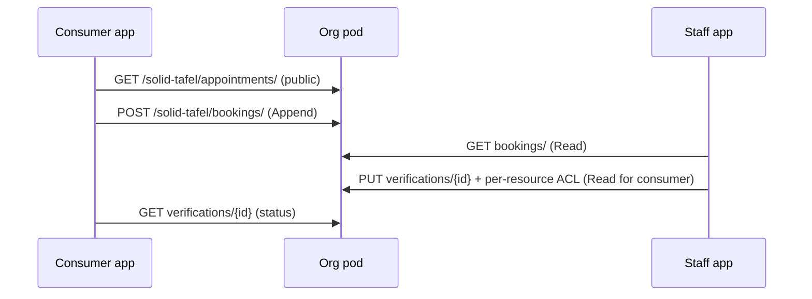
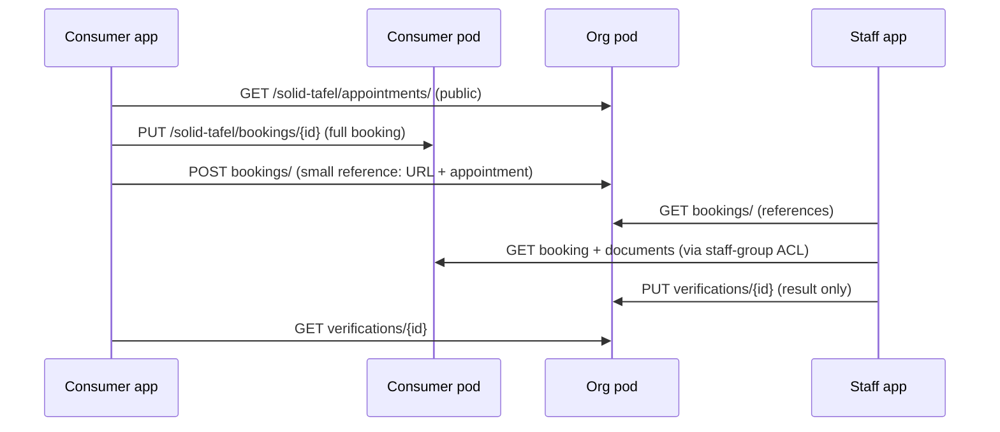

# Pod Layout — solid-tafel

**Status:** DRAFT for v0.0.6 (design groundwork, no code change)
**Decision inputs:** org, admin and consumer pods use the **same structure**; everything lives in **one container at the pod root, named after the app: `/solid-tafel/`**.

Differences between roles come from **ACLs and group membership**, not from different schemas.

---

## 1. Container layout (identical in every pod)

```
{pod-root}/
└── solid-tafel/                 owner: Control (default for all children)
    ├── profile/                 app settings (e.g. preferred location)
    ├── appointments/            distribution slots (used in ORG pods)
    ├── bookings/                consumer: own bookings | org: booking inbox
    ├── documents/               consumer: uploaded proofs (Sozialhilfe-Bescheid)
    ├── verifications/           org: verification results (no document copies)
    └── staff/                   org: group documents (vcard:Group)
        ├── herford.ttl
        ├── bielefeld.ttl
        └── admins.ttl
```

Not every container is used in every pod. An empty container is harmless, and a uniform layout means one code path for locating data.

Examples:
- Org pod: `https://herford.meisdata.io/solid-tafel/appointments/`
- Consumer pod: `https://alice.solidweb.org/solid-tafel/documents/`

---

## 2. Roles

| Role | How the app knows | Typical pod |
|------|-------------------|-------------|
| **Consumer** | Logged in, not in any staff group | own personal pod |
| **Staff** (helper) | WebID listed in `staff/<location>.ttl` of the org pod | own pod + org pod access |
| **Admin** | WebID listed in `staff/admins.ttl` | own pod + Control on org pod |
| **Public** | not logged in | reads public data only |

**Role detection (for v0.1.0):** after login, fetch the org pod's group documents and check whether the user's WebID is a `vcard:hasMember`. No membership means consumer.

---

## 3. Permission matrix

### Org pod, `/solid-tafel/`

| Container | Public | Authenticated | Staff (location) | Admin |
|-----------|--------|---------------|------------------|-------|
| `appointments/` | Read | Read | Read, Write | Control |
| `bookings/` (inbox) | none | **Append** | Read, Write | Control |
| `verifications/` | none | Read *own file only* (per-resource ACL) | Read, Write | Control |
| `staff/` | Read (group docs) | Read | Read | Write, Control |

`appointments/` holds only time, place and capacity, never personal data. Making it public is what allows the calendar to show before login.

### Consumer pod, `/solid-tafel/`

| Container | Owner | Staff of chosen location | Everyone else |
|-----------|-------|--------------------------|---------------|
| `profile/` | Control | none | none |
| `bookings/` | Control | Read | none |
| `documents/` | Control | Read | none |

Use **one group per location**, so Bielefeld staff cannot read Herford consumers' documents.

### ACL sketches

Org `bookings/` (append-only inbox):

```turtle
@prefix acl: <http://www.w3.org/ns/auth/acl#> .

<#owner> a acl:Authorization ;
  acl:agent <https://herford.meisdata.io/profile/card#me> ;
  acl:accessTo <./> ; acl:default <./> ;
  acl:mode acl:Read, acl:Write, acl:Control .

<#staff> a acl:Authorization ;
  acl:agentGroup <../staff/herford.ttl#staff> ;
  acl:accessTo <./> ; acl:default <./> ;
  acl:mode acl:Read, acl:Write .

<#append> a acl:Authorization ;
  acl:agentClass acl:AuthenticatedAgent ;
  acl:accessTo <./> ;
  acl:mode acl:Append .
```

Consumer `documents/` (owner plus staff group read):

```turtle
<#owner> a acl:Authorization ;
  acl:agent <https://alice.solidweb.org/profile/card#me> ;
  acl:accessTo <./> ; acl:default <./> ;
  acl:mode acl:Read, acl:Write, acl:Control .

<#staff-read> a acl:Authorization ;
  acl:agentGroup <https://herford.meisdata.io/solid-tafel/staff/herford.ttl#staff> ;
  acl:accessTo <./> ; acl:default <./> ;
  acl:mode acl:Read .
```

Caveat: the consumer's server must be able to fetch the group document to evaluate the ACL. The group document therefore has to be readable without login, which makes staff WebIDs public. Staff should be told this.

---

## 4. Booking workflow: two designs

Neither design can enforce capacity atomically, because Solid has no transactions. In both, a booking is a **request** that staff (or a rule) confirm, so overbooking is resolved by confirmation, not by locking.

### Design A: booking lives in the org pod



- **Pros:** one place to count capacity, and staff see everything in one container.
- **Cons:**
  - Append-only means the consumer cannot read back or delete their own request unless staff add an ACL.
  - Personal data (name, household size) sits in the org pod.
  - Cancelling requires staff action.

### Design B: booking lives in the consumer pod (recommended lean)



- **Pros:**
  - The consumer owns the booking and can withdraw it by deleting it.
  - Documents never leave the consumer's pod. The org stores only the result (verified, expired, pending).
  - This matches Solid's ownership model and is easier to defend under DSGVO.
- **Cons:**
  - Staff must read across many pods, which is slower and breaks if a consumer's pod is offline.
  - The consumer app has to write ACLs (grant the staff group Read), which is more client logic.
  - The org's reference inbox can contain stale links to deleted bookings.

**Suggested hybrid:** Design B for documents (always), and for bookings start with Design A for simplicity in 0.1.x, because offline consumer pods make staff views unreliable. Move to B if Herford prefers data minimisation. This is your decision.

---

## 5. Open questions

1. Design A, B or the hybrid for bookings?
2. One org pod per location (herford/bielefeld), as assumed here, or one shared org pod with location as data?
3. May staff WebIDs be public in group documents (see the caveat above)?
4. Do consumers without their own pod get a pod from the app, or is a Solid pod a prerequisite? (Herford will need an answer.)
5. How long are verification results kept, and who deletes them?
6. Where do admin-only settings (capacity defaults, opening days) live? Proposed: `profile/` of the org pod.

---

## 6. What this means for v0.1.0

- Read `staff/*.ttl` for role detection.
- Read `appointments/` (public) for the list.
- No writes yet. The write paths above become v0.2+.
